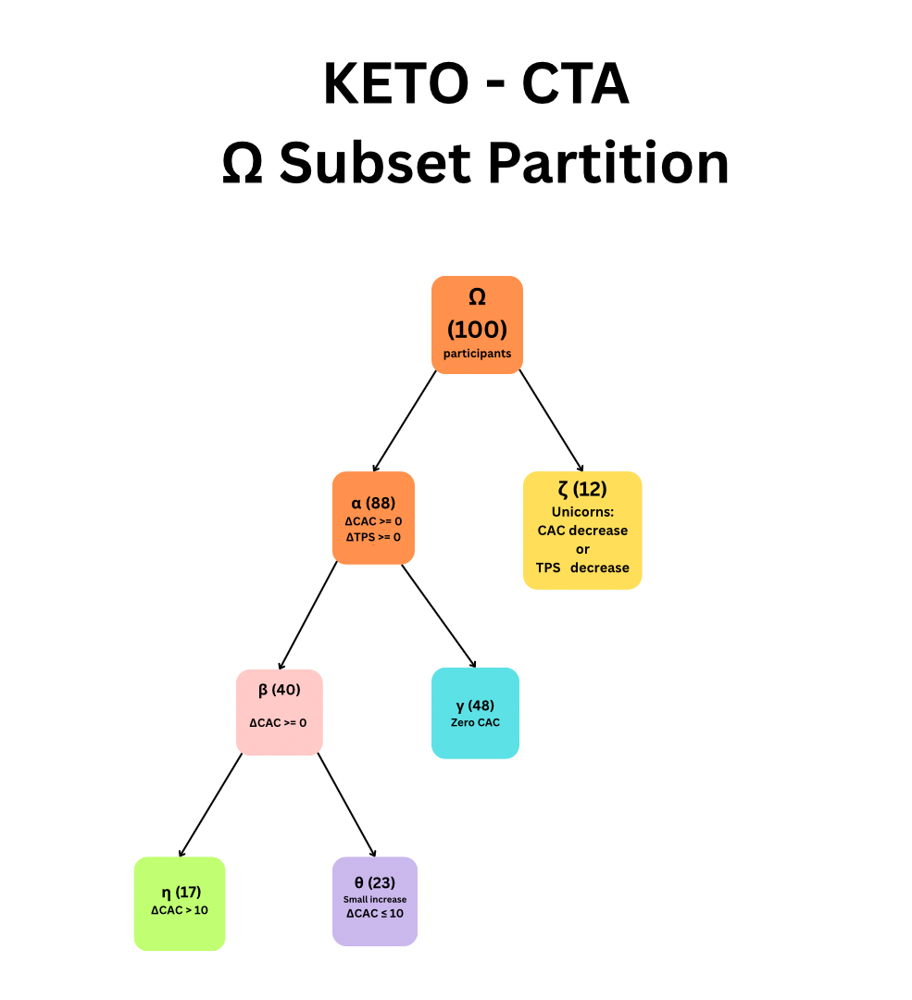
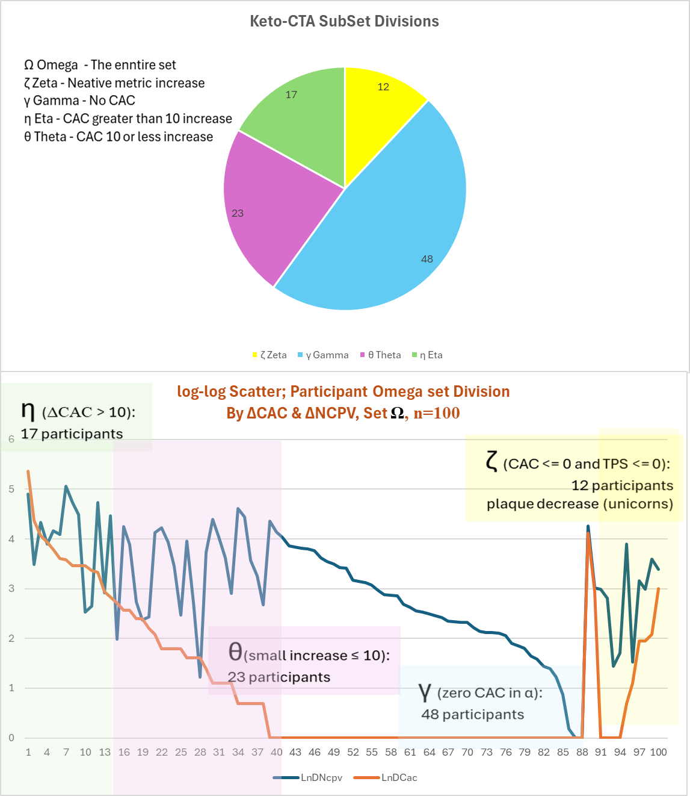
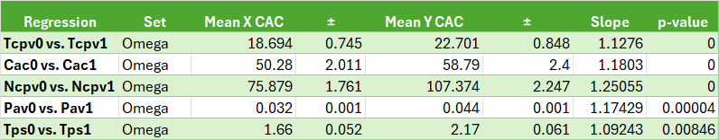

# Keto-CTA Dataset Analysis and Software Specification

## Disclaimer

This project, **Keto_CTA**, is an independent software development initiative. It is **not affiliated with** the Citizen Science Foundation, Lundquist Institute, or any other organization. The dataset used is publicly available for research from the Citizen Science Foundation. All analyses and software specifications herein are provided solely for educational and research purposes.

---

## Overview
### There are Two main components to this project both of which are highly dependent on Linear Regressions
1. Data Mining, creating an exhaustive list of all possible linear relationships between the variables in the dataset.
2. Ketone and Glucose data analysis, which plots ketone and glucose for participants

### Top Level Data transformation 
- **High level objective**
- **Purpose:** To understand what this all means, at the deepest level of the data
a. Ceation of a new Keto-CTA file enhanced with Delta and Logarithmic values for each of the variables in the dataset.
b. Division of the Keto-CTA dataset into sets based on the presence of plaque reversal and CAC scores done in core classes, 
c. Preliminary analisis of the Keo-CTA dataset to revealed the exponetial character of the data the logarithmic relationship between the variables in the dataset.
d. Preliminary analysis also reveled the presence of clear divisions in the data based on 
NCPV and CAC and their change (Deltas)between visits.

 [*See Keto-CTA Enhanced Data set*](./Analysis/Keto-CTA-EnhancedDataSet.txt).

**Element** and **Visit**.
### Data Classes
- **Element**
	1. **Sub Set** - The subset of the dataset that this element belongs to, based on the presence of plaque reversal and CAC scores. Zeta, Gamma, Theta, and Alpha are the leaf sets.
	2. **Id** - The original keto-cta-quant dataset does not have a unique key, so we create one based on the row number of the source dataset.
	3. An array of **Visit[]** indexed from 0. There are currently two visits for each element.  
	4. **DCac** - One year change in Coronary Artery Calcium
	5. **DNcpv** - One year change in Non-Calcified Plaque Volume
	6. **DTps** - One year change in Total Plaque Score
	7. **DTcpv** - One year change in Total Calcified Plaque Volume
	8. **DPav** - One year change in Percent Atheroma Volume
	9. **LnDCac, LnDNcpv, LnTcpv, LnDPav**, Logarithmic transformations of the above values to improve linear relationships and handle
exponential distributions of these root values.

- **Visit** 
	1. **Id** - Visit number, starting from 0, also called 'baseline'
	2. **VisitDate** - Currently not popilated but we do need this data to see if there are group changes related to enviromental data like seasons or the Covid Pandemic
	3. **Tps** - Total Plaque Score
	4. **Cac** - Coronary Artery Calcium score
	5. **Ncpv** - Non-Calcified Plaque Volume
	6. **Tcpv** - Total Calcified Plaque Volume
	7. **Pav** - Percent Atheroma Volume
	8. **LnTps, LnCac, LnNcpv, LnTcpv, LnPav** - Logarithmic transformations of the above values to improve linear relationships.
	Delta values are not applickable to individual Visit data.

---

### Set Hierarchy
- In set mathmatics theory it is traditonal to name sets using greek letters, typically the superset is given the label Omega to represent everything.
- This Omega set hierarchy was used to categorize Participant based in the presence of  Plaque reversal and their CAC scores.
- This is the most important part of the analysis, as it allows us to see how the participants are divided based on their CAC and TPS scores.
- **This IS the root of this project.**

- The hierarchy is based on the presence of plaque reversal and CAC scores, with the following categories:
**Definitions based on the provided sets and conditions:**
- **isZeta** = (This set contains participants with oulier CAC or Cleerly decreases))
	- v2.Tps < v1.Tps
	- or v2.Cac < v1.Cac
	- or v2.Ncpv < v1.Ncpv
	- or v2.Tcpv < v1.Tcpv
	- or v2.Pav < v1.Pav;

- **Ω (Omega)** : All participants  
  &nbsp;&nbsp;&nbsp;&nbsp;◦ 100 participants
- **α (Alpha)** : { x ∈ Ω | ¬isZeta(x) }  
  &nbsp;&nbsp;&nbsp;&nbsp;◦ 88 participants (CAC and TPS stable or increasing)
- **ζ (Zeta)** : { x ∈ Ω | isZeta(x) }  
  &nbsp;&nbsp;&nbsp;&nbsp;◦ 12 participants (CAC or TPS decrease, “Unicorns”)
- **β (Beta)** : { x ∈ α | cac1(x) ≠ 0 ∨ cac2(x) ≠ 0 }  
  &nbsp;&nbsp;&nbsp;&nbsp;◦ 40 participants (non-zero CAC in α)
- **γ (Gamma)** : { x ∈ α | cac1(x) = 0 ∧ cac2(x) = 0 }  
  &nbsp;&nbsp;&nbsp;&nbsp;◦ 48 participants (zero CAC in α)
- **η (Eta)** : { x ∈ β | Δcac(x) > 10 }  
  &nbsp;&nbsp;&nbsp;&nbsp;◦ 17 participants (larger CAC increase)
- **θ (Theta)** : { x ∈ β | Δcac(x) ≤ 10 }  
  &nbsp;&nbsp;&nbsp;&nbsp;◦ 23 participants (smaller CAC increase)

---

## Data Mining and Analysis Summary

### 1. Logarithmic Relationship Verification
- Computed Pearson correlations and \( R^2^ and p-values \) values between V1 and V2 metrics (both raw and log-transformed).
- Found consistent improvement in linearity after log transformation.

### 2. Summary Table (Key attribute results)

[*See full table in analysis folder*](./Analysis/Keto-CTA-Regressions.txt).
### Just the Omega superset
- Average CAC for the fist Visit wa 50.28 ± 2.011
- Average CAC for the secod visit was 58.79 ± 2.4
- Average NCPV for the first visit was 75.88 ± 1.76
- Average NCPV for the second visit was 107.374 ± 2.25
- You get the idea ... the p-values are pretty good for these regressions and say that if this demographic has CAC of X
from their first scan they should have a CAC * the slope one year later.
My CAC baseline scan was 21 so I should have had CAC of had a CAC of 21 * 1.8 a year later, or 24.8. I had a actuall CAC of 21 again  a year later 
but note that would be ±2.4 and 21+2.4 is 23.4 which is no to far short of the upper range of the predicted value.  It is even closer if you look at the Theta subset regressions which have a lower slope.
- Of course my NCPV tells a very different story ...

---

## Software Design and Engineering Specification

The following modules define the prototype platform for dataset ingestion, analysis, and visualization:

### 1. Data Miner
- Focus is to create an exhaustive list of all.

### 2. Statistical Analysis
- Correlation and \( R^2 \) computation for raw and log-transformed data.
- Ensure invariance to input row order.
- Handle zero values with `ln(value + 0.1)` transform.

### 4. Visualization with CSV exports for Excel, and Graphics matrixes for Python plotting
- Scatter plots (raw/log) with labeled axes and trendlines.
- Color-coded metrics for comparative insight.

### 5. Error Handling and UX
- Feedback on missing/invalid inputs.
- Adaptive metrics and analysis expansion.
- Resilience to user/environment constraints.

### 6. Extensibility
- Modular design for new datasets, transformations, and chart types.
- Example: Addition of TCPV and PAV without structural changes.

### Proposed Architecture

- **Frontend**: Upload, metric selection, visual output  
- **Backend**: Statistical engine, schema logic  
- **Database**: Stores datasets and schemas  
- **API**: Upload, analyze, retrieve  
- **UX**: Emphasis on clarity and scientific rigor

---

## Usage

To use this project:
- Explore the summary statistics and correlation results.
- Apply the JSON schema for validation.
- Reference the engineering spec to build or extend analytical tools.

To contribute:
1. Fork the repo.
2. Add new features, analyses, or visualizations.
3. Submit a pull request with a clear explanation.

---

## License

Licensed under the [Affero General Public License (AGPL-3.0)](./LICENSE).

---

## Contact

**Jillian England**  
📧 jill.england@comcast.net  

For dataset inquiries, contact the Citizen Science Foundation or join discussion on social media (e.g., #KetoCTA, #CitizenScience, FB: LMHR).

> This is a living document. Please report errors or suggest improvements for the benefit of the research community.

---
